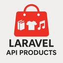

<p align="center">
    
</p>

# Product Catalog REST API

### Built using **Laravel 12.3** and **PHP 8.3**

## About

### A flexible Laravel API for handling products across various categories like books, fashion, and music. Includes dynamic pagination, Swagger docs, seeding, and clean API responses.

Developed an API endpoint that is capable of returning a paginated collection of different types of objects. 
The endpoint can also receive a "quantity" query parameter that specifies how many products should be generated.

Each object represents a product that could be sold in an online shop.

It is a simple and small project, that's why I created one products table instead of multiple tables 
(products, books, ...). It is simpler and queries are easier.

Some attributes should always be present on a product and should have a procedurally generated value.

Some attributes should randomly be present or not. Added a condition to decide when to add an optional attribute to a 
product and when to omit it. When optional attributes are present, they should always have a value.

## Note

For the generation of various test values I used Laravel's built-in factory functionality.

### Mock Request / Response

`http://laravel.app/api/v1/products?quantity=50`

```json
{
   "total": 50,
   "per_page": 15,
   "current_page": 1,
   "last_page": 4,
   "first_page_url": "http://laravel.app?page=1?quantity=50",
   "last_page_url": "http://laravel.app?page=4?quantity=50",
   "next_page_url": "http://laravel.app?page=2?quantity=50",
   "prev_page_url": null,
   "path": "http://laravel.app",
   "from": 1,
   "to": 15,
   "data":[
        {
            "type": "FASHION",
            "name": "Blue T-Shirt",
            "size": "L",
            "gallery": [
                "https://picsum.photos/id/10/300/300",
                "https://picsum.photos/id/11/300/300",
                "https://picsum.photos/id/12/300/300",
            ],
            "price": "80",
            "discount": "0.35",
            "quantity": "7"
        },
        {
            "type": "BOOK",
            "name": "Happy Days are Happy Days",
            "author": "Lorem Ipsum",
            "image": "https://picsum.photos/id/10/300/300",
            "publisher": "Sit Amet",
            "price": "49",
            "quantity": "31"
        },
        {
            "type": "MUSIC",
            "name": "Country Album",
            "artist": "Consectetur Adipiscing",
            "media": "Vinyl",
            "price": "85",
            "discount": "0.1"
        },
        // ...
   ]
}
```

## Installation

Follow these steps to set up the project locally.

### Prerequisites

- **PHP 8.3** or higher
- **Composer** (for managing PHP dependencies)
- **Laravel 12.3** (install via Composer)
- **MySQL** or any database supported by Laravel

### Step 1: Clone the repository

Clone the repository to your local machine using Git.

```bash
git clone https://github.com/adorjan-szasz/product-api.git

cd product-api
```

### Step 2: Install dependencies

Run the following command to install all the required PHP dependencies:

```bash
composer install
```

### Step 3: Set up the environment file

Copy the .env.example file to .env:

```bash
cp .env.example .env
```

### Step 4: Configure environment settings

In the .env file, configure your database and other settings:

DB_CONNECTION=mysql
DB_HOST=127.0.0.1
DB_PORT=3306
DB_DATABASE=product_api
DB_USERNAME=
DB_PASSWORD=

### Step 5: Generate the application key

Generate the application key using Artisan:

```bash
php artisan key:generate
```

### Step 6: Run migrations and seed data

Run the database migrations to create the necessary tables and seed data:

```bash
php artisan migrate --seed
```

### Step 7: Run the application

Now, you can run the application locally using Laravel's built-in development server:

```bash
php artisan serve
```
